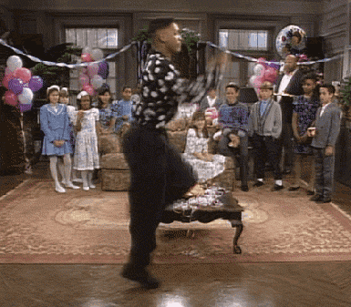
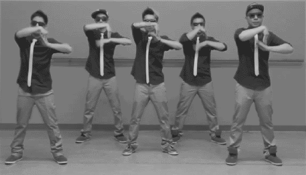

## git is a distributed version control system


## git is also a lot like dancing
</img> 

## You can dance on your own ..
</img> 

## .. or with your friends
</img> 

## But alone or in groups, git is fun & useful!

git is a useful tool for

- tracking changes to files
- organizing projects
- **sharing** data and code 

## Today: the Basic Step


* starting a repo
* making commits
* using remotes

# Dancing shoes:

## the necessary equipment

- Rstudio
- git
- git bash (windows)

## Start the music!
- create a new directory 
       <p style="font-size:11px"> suggestion: not in your desktop </p>
- open git bash or terminal

## In a terminal

```sh
cd path/to/your/directory
```
```git
git init
```

## Do some work

- open a text editor
   <small> something simple: notepad, gedit, `nano` </small>
- write out the title of a project you're working on:

```txt
# This is my title
```

- save in your new directory as **README.md**

## Back in the command line:

- `git status`
- `git add README.md`
- `git commit -m "adding a readme file"`

## Back in the editor:
- add your name
- save
- `git status`
- `git add .`
- `git commit -m "adding my name"`

## The Step:

- **work**
- **save**
- `git add .`
- `git commit `
- **work**
- **save**
- `git add .`
- `git commit `

## Let's take a look at our progress
```bash
git log
```
```bash
git log -p -3
```

## how git stores data {.flexbox .vcenter}
</img>

## The Three Areas  {.flexbox .vcenter}
</img>

**This is the main thing to remember about Git if you want the rest of your learning process to go smoothly. Git has three main states that your files can reside in: *committed*, *modified*, and *staged***. [git book](http://git-scm.com/book/en/v2/Getting-Started-Git-Basics)

## Other steps (if we have time):
- To the side!
```
git branch
```
- To the back!
```
git checkout
```

# Get out on the floor

## Add a remote repository:

- First, go to github and start a repository
- Follow the steps!
```shell
git remote add origin https://github.com/aammd/practice.git
git push -u origin master
```
- [Rstudio buttons greyed out?](http://landeco2point0.wordpress.com/2014/07/22/things-i-forget-pushpull-greyed-out-in-rstudio/)


## Github

- Organizing classes [course](https://github.com/STAT545-UBC/STAT545-UBC.github.io) [website](http://stat545-ubc.github.io/)
- Lab groups: [Weecology](https://github.com/weecology)
- Models e.g. *Mutualists and Dispersal* [model](https://github.com/tpoisot/ProtectiveMutualismModel) [paper](http://onlinelibrary.wiley.com/doi/10.1002/ece3.1151/full)
- R packages [codyn](https://github.com/laurenmh/codyn), [dplyr](https://github.com/hadley/dplyr), [vegan](https://github.com/vegandevs/vegan), (see for example [Matt Barbour's contribution](https://github.com/vegandevs/vegan/blob/6c108fa55254aa06c0286f8b4e4bdecf4260eae0/inst/ChangeLog#L235) )
- [Make your code citable](https://guides.github.com/activities/citable-code/)

## Cloning a repository
Cloning a repository gives you a copy
Let's clone this repository 
```html
https://github.com/aammd/git-dance
```